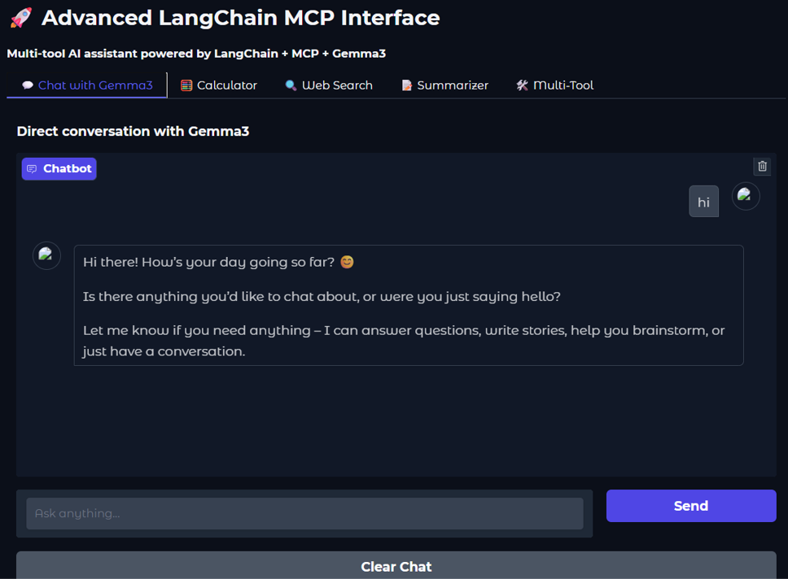
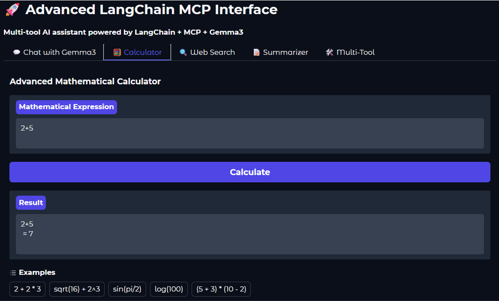
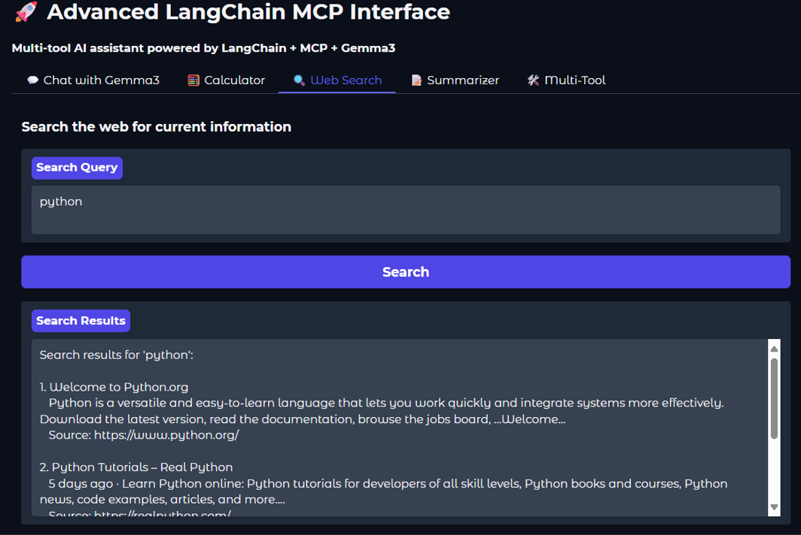
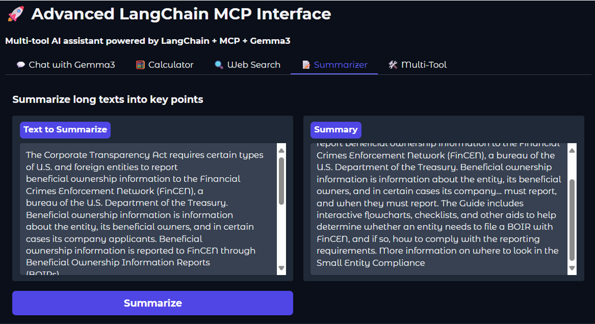

# MCP with Lanchain

from langchain_core.tools import tool
from langchain_mcp_adapters.tools import to_fastmcp
from mcp.server.fastmcp import FastMCP

# Tools
## Calculate / web-search / summarize 

